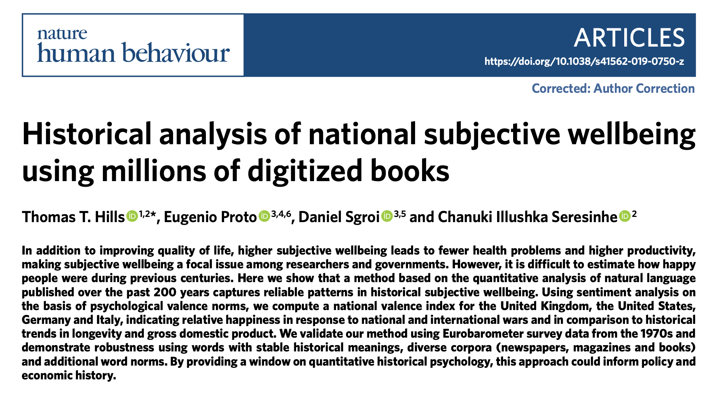
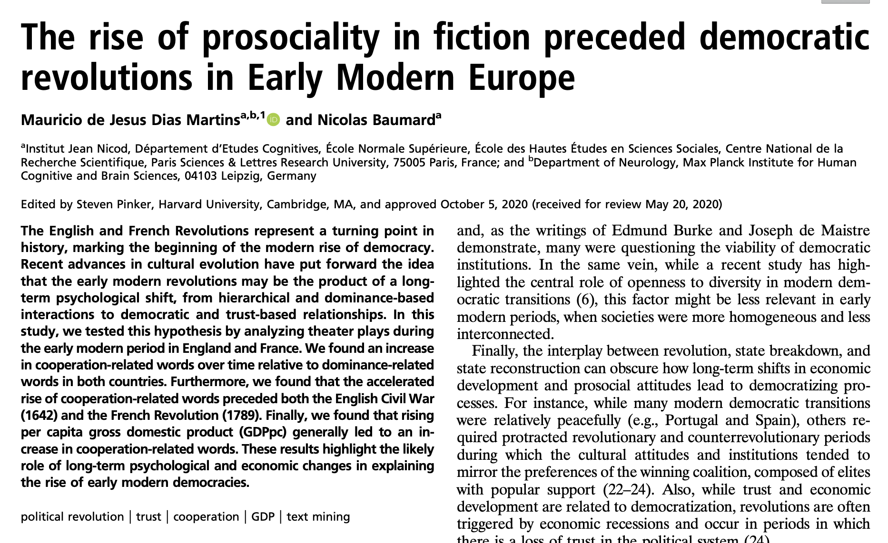
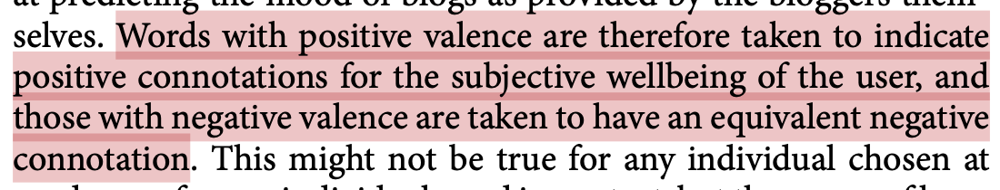
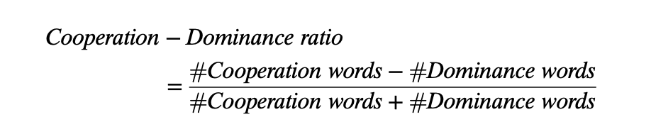
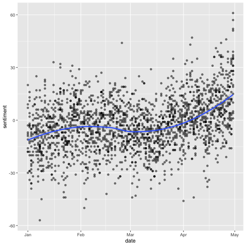

Sentiment Analysis
========================================================
author: Christopher Barrie 
date: Thursday, October 28: NCRM
width: 2500
height: 900
transition: none  
  website: https://cjbarrie.xyz     
  github: https://github.com/cjbarrie       
  Twitter: https://www.twitter.com/cbarrie
  
Sentiment analysis
========================================================

- Tokenizing
- Counting words with dictionary
- Denominating by totals

========================================================

<center>

</center>

========================================================

<center>

</center>


Sentiment analysis
========================================================

- A sample of words from Pride and Prejudice


```
 [1] "heightened"    "intimate"      "blue"          "suspicion"    
 [5] "gaped"         "finest"        "creatures"     "pack"         
 [9] "contribute"    "tradesman's"   "peculiarly"    "concealed"    
[13] "cottagers"     "expostulation" "unjustly"      "founded"      
[17] "adventure"     "conciliate"    "animation"     "abuse"        
[21] "requited"      "guilty"        "repined"       "friend's"     
[25] "accede"        "readily"       "appointment"   "sooner"       
[29] "occasion's"    "lucases"       "beauteous"     "yawn"         
[33] "travelling"    "counterpart"   "prudential"    "hertfordshire"
[37] "temptations"   "jenkinson"     "levelled"      "clement's"    
[41] "change"        "headstrong"    "importance"    "meryton"      
[45] "quarreling"    "commencement"  "feet"          "longed"       
[49] "resisting"     "bosoms"       
```

Sentiment analysis
========================================================


```r
bingsent <- get_sentiments("bing")
bingsent
```

```
# A tibble: 6,786 x 2
   word        sentiment
   <chr>       <chr>    
 1 2-faces     negative 
 2 abnormal    negative 
 3 abolish     negative 
 4 abominable  negative 
 5 abominably  negative 
 6 abominate   negative 
 7 abomination negative 
 8 abort       negative 
 9 aborted     negative 
10 aborts      negative 
# … with 6,776 more rows
```

Sentiment analysis
========================================================

- Pride and Prejudice words tagged with sentiment 


```
# A tibble: 11 x 2
   word       sentiment
   <chr>      <chr>    
 1 abuse      negative 
 2 beauteous  positive 
 3 conciliate positive 
 4 finest     positive 
 5 guilty     negative 
 6 intimate   positive 
 7 peculiarly negative 
 8 readily    positive 
 9 suspicion  negative 
10 unjustly   negative 
11 yawn       negative 
```

========================================================

<center>

</center>
- Source: Hills et al. 2021. "Historical analysis of national subjective wellbeing using millions of digitized books," *Nature Human Behaviour*, 3:1271–1275.

========================================================

<center>

</center>
- Source: Martins, Mauricio de Jesus Dias and Nicolas Baumard. 2021. "The rise of prosociality in fiction preceded democratic revolutions in Early Modern Europe," *Proceedings of the National Academy of Sciences*, 117(46) 28684–28691.

Running Your Own Analysis: News tweets
========================================================


```r
library(tidyverse) # loads dplyr, ggplot2, and others
library(readr) # more informative and easy way to import data
library(stringr) # to handle text elements
library(tidytext) # includes set of functions useful for manipulating text

tweets  <- readRDS(gzcon(url("https://github.com/cjbarrie/CTA-NCRM/blob/main/02-sent-analysis/data/newstweets.rds?raw=true")))
```

Sentiment dictionaries
========================================================
* `AFINN` from [Finn Årup Nielsen](http://www2.imm.dtu.dk/pubdb/views/publication_details.php?id=6010),
* `bing` from [Bing Liu and collaborators](https://www.cs.uic.edu/~liub/FBS/sentiment-analysis.html), and
* `nrc` from [Saif Mohammad and Peter Turney](http://saifmohammad.com/WebPages/NRC-Emotion-Lexicon.htm)

Getting sentiment dictionaries
========================================================

```r
get_sentiments("afinn")
```

```
# A tibble: 2,477 x 2
   word       value
   <chr>      <dbl>
 1 abandon       -2
 2 abandoned     -2
 3 abandons      -2
 4 abducted      -2
 5 abduction     -2
 6 abductions    -2
 7 abhor         -3
 8 abhorred      -3
 9 abhorrent     -3
10 abhors        -3
# … with 2,467 more rows
```

Getting sentiment dictionaries
========================================================

```r
get_sentiments("nrc")
```

```
# A tibble: 13,901 x 2
   word        sentiment
   <chr>       <chr>    
 1 abacus      trust    
 2 abandon     fear     
 3 abandon     negative 
 4 abandon     sadness  
 5 abandoned   anger    
 6 abandoned   fear     
 7 abandoned   negative 
 8 abandoned   sadness  
 9 abandonment anger    
10 abandonment fear     
# … with 13,891 more rows
```

Getting sentiment dictionaries
========================================================

```r
get_sentiments("bing")
```

```
# A tibble: 6,786 x 2
   word        sentiment
   <chr>       <chr>    
 1 2-faces     negative 
 2 abnormal    negative 
 3 abolish     negative 
 4 abominable  negative 
 5 abominably  negative 
 6 abominate   negative 
 7 abomination negative 
 8 abort       negative 
 9 aborted     negative 
10 aborts      negative 
# … with 6,776 more rows
```

Curate tweets data
========================================================


```r
tweets <- tweets %>%
  select(user_username, text, created_at, user_name,
         retweet_count, like_count, quote_count) %>%
  rename(username = user_username,
         newspaper = user_name,
         tweet = text)
```

Preprocess Tahrir documents
========================================================


```r
tidy_tweets <- tweets %>% 
  mutate(desc = tolower(tweet)) %>%
  unnest_tokens(word, desc) %>%
  filter(str_detect(word, "[a-z]"))

tidy_tweets <- tidy_tweets %>%
    filter(!word %in% stop_words$word)
```

Inspect
========================================================


```r
tidy_tweets %>%
  count(word, sort = TRUE)
```

```
# A tibble: 240,027 x 2
   word             n
   <chr>        <int>
 1 https       214857
 2 t.co        212579
 3 coronavirus  30282
 4 rt           22357
 5 uk            7568
 6 lockdown      6527
 7 home          5245
 8 mum           4509
 9 people        4506
10 nhs           4195
# … with 240,017 more rows
```

Order by date and index
========================================================


```r
#order and format date
tidy_tweets$date <- as.Date(tidy_tweets$created_at)

tidy_tweets <- tidy_tweets %>%
  arrange(date)

tidy_tweets$order <- 1:nrow(tidy_tweets)
```

Get sentiments in tidy format
========================================================


```r
#join pamphlets with nrc sentiment data
tweets_nrc_sentiment <- tidy_tweets %>%
  inner_join(get_sentiments("nrc"))
```

Get sentiments in tidy format
========================================================


```r
#calculate sentiment over per 1000 words per date
tweets_nrc_sentiment <- tweets_nrc_sentiment %>%
  count(date, index = order %/% 1000, sentiment)

head(tweets_nrc_sentiment)
```

```
# A tibble: 6 x 4
  date       index sentiment        n
  <date>     <dbl> <chr>        <int>
1 2020-01-01     0 anger           45
2 2020-01-01     0 anticipation    39
3 2020-01-01     0 disgust         31
4 2020-01-01     0 fear            51
5 2020-01-01     0 joy             37
6 2020-01-01     0 negative        86
```

Get sentiments in tidy format
========================================================


```r
#separate into 
tweets_nrc_sentiment <- tweets_nrc_sentiment %>%
  spread(sentiment, n, fill = 0)

head(tweets_nrc_sentiment)
```

```
# A tibble: 6 x 12
  date       index anger anticipation disgust  fear   joy negative positive sadness surprise trust
  <date>     <dbl> <dbl>        <dbl>   <dbl> <dbl> <dbl>    <dbl>    <dbl>   <dbl>    <dbl> <dbl>
1 2020-01-01     0    45           39      31    51    37       86       70      40       19    41
2 2020-01-01     1    33           27      16    47    27       69       51      31       16    31
3 2020-01-01     2    39           31      14    44    23       66       57      27       18    32
4 2020-01-01     3    19           32       8    42    26       43       63      23       15    33
5 2020-01-01     4    39           36      27    50    27       78       60      37       24    38
6 2020-01-01     5    44           30      25    60    35       83       72      38       22    37
```

Get sentiments in tidy format
========================================================


```r
#separate into 
tweets_nrc_sentiment <- tweets_nrc_sentiment %>%
  mutate(sentiment = positive - negative)

head(tweets_nrc_sentiment)
```

```
# A tibble: 6 x 13
  date       index anger anticipation disgust  fear   joy negative positive sadness surprise trust sentiment
  <date>     <dbl> <dbl>        <dbl>   <dbl> <dbl> <dbl>    <dbl>    <dbl>   <dbl>    <dbl> <dbl>     <dbl>
1 2020-01-01     0    45           39      31    51    37       86       70      40       19    41       -16
2 2020-01-01     1    33           27      16    47    27       69       51      31       16    31       -18
3 2020-01-01     2    39           31      14    44    23       66       57      27       18    32        -9
4 2020-01-01     3    19           32       8    42    26       43       63      23       15    33        20
5 2020-01-01     4    39           36      27    50    27       78       60      37       24    38       -18
6 2020-01-01     5    44           30      25    60    35       83       72      38       22    37       -11
```

Plot
========================================================


```r
tweets_nrc_sentiment %>%
  ggplot(aes(date, sentiment)) +
  geom_point(alpha=0.5) +
  geom_smooth(method= loess, alpha=0.25)
```

========================================================



Worksheets
========================================================

- [https://github.com/cjbarrie/CTA-NCRM](https://github.com/cjbarrie/CTA-NCRM)
