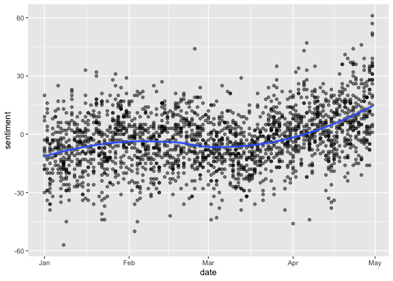
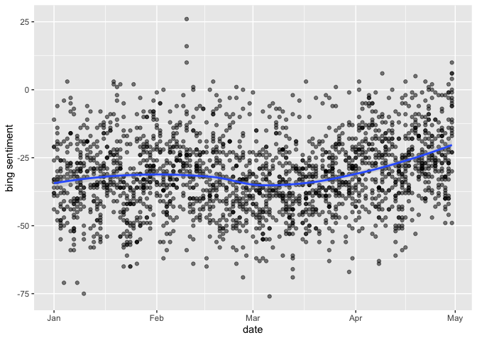
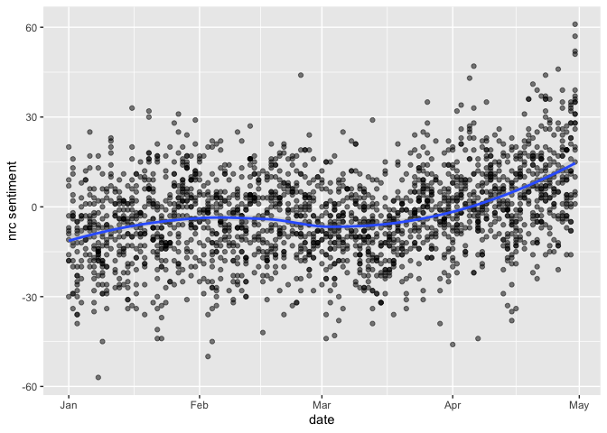
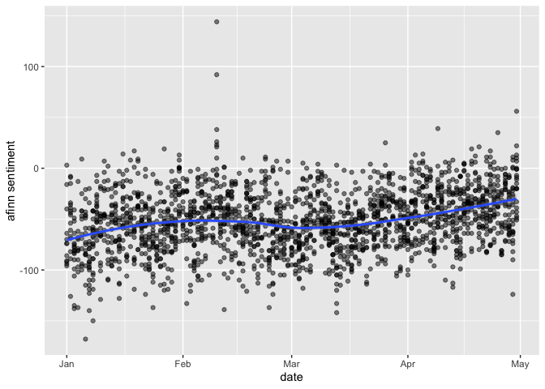
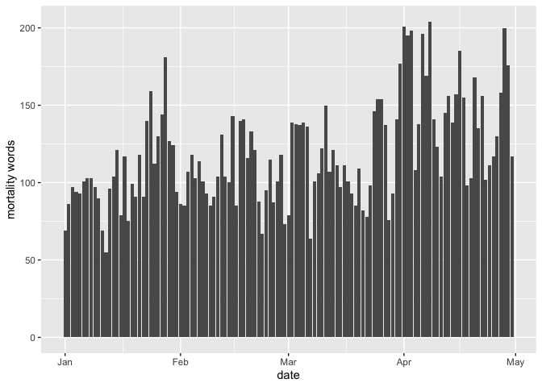
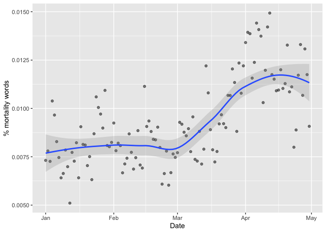

# Exercise 2: Sentiment analysis

The lecture mentioned work by @Lansdall-Welfare2017 and @Martins2020a. Both articles use different forms of sentiment analysis, constructing indices of different types. 

## Introduction

In this tutorial, you will learn how to:

* Use dictionary-based techniques to analyze text
* Use common sentiment dictionaries
* Create your own "dictionary"

## Setup 

The hands-on exercise for this week uses dictionary-based methods for filtering and scoring words. Dictionary-based methods use pre-generated lexicons, which are no more than list of words with associated scores or variables measuring the valence of a particular word. In this sense, the exercise is not unlike our analysis of Edinburgh Book Festival event descriptions. Here, we were filtering descriptions based on the presence or absence of a word related to women or gender. We can understand this approach as a particularly simple type of "dictionary-based" method. Here, our "dictionary" or "lexicon" contained just a few words related to gender. 

##  Load data and packages 

Before proceeding, we'll load the remaining packages we will need for this tutorial.


```r
library(academictwitteR) # for fetching Twitter data
library(tidyverse) # loads dplyr, ggplot2, and others
library(readr) # more informative and easy way to import data
library(stringr) # to handle text elements
library(tidytext) # includes set of functions useful for manipulating text
```


In this exercise we'll be using another new dataset. The data were collected from the Twitter accounts of the top eight newspapers in the UK by circulation. You can see the names of the newspapers in the code below:


```r
newspapers = c("TheSun", "DailyMailUK", "MetroUK", "DailyMirror", 
               "EveningStandard", "thetimes", "Telegraph", "guardian")

tweets <-
  get_all_tweets(
    users = newspapers,
    start_tweets = "2020-01-01T00:00:00Z",
    end_tweets = "2020-05-01T00:00:00Z",
    file = "newstweets,rds",
    data_path = "data/",
    n = Inf,
  )

tweets <- 
  bind_tweets(data_path = "data", output_format = "tidy")

saveRDS(tweets, "newstweets.rds")
```


{width=100%}

For details of how to access Twitter data with `academictwitteR`, check out details of the package [here](https://cran.r-project.org/web/packages/academictwitteR/index.html).

We can download the final dataset with:


```r
tweets <- readRDS("data/newstweets.rds")
```

If you're working on this document from your own computer ("locally") you can download the tweets data in the following way:


```r
tweets  <- readRDS(gzcon(url("https://github.com/cjbarrie/CTA-NCRM/blob/main/02-sent-analysis/data/newstweets.rds?raw=true")))
```

## Inspect and filter data 

Let's have a look at the data:


```r
head(tweets)
```

```
## # A tibble: 6 x 31
##   tweet_id   user_username text             created_at   conversation_id source 
##   <chr>      <chr>         <chr>            <chr>        <chr>           <chr>  
## 1 121233868… DailyMirror   "'Real' Star Wa… 2020-01-01T… 12123386804022… TweetD…
## 2 121233846… DailyMirror   "RT @MirrorRoya… 2020-01-01T… 12123384625543… TweetD…
## 3 121233832… TheSun        "Prince Andrew … 2020-01-01T… 12123383296241… Echobox
## 4 121233779… DailyMirror   "RT @MirrorMone… 2020-01-01T… 12123377991034… TweetD…
## 5 121233768… DailyMailUK   "James Argent t… 2020-01-01T… 12123376806562… Social…
## 6 121233767… TheSun        "Ronaldo plays … 2020-01-01T… 12123376738657… Twitte…
## # … with 25 more variables: possibly_sensitive <lgl>, author_id <chr>,
## #   lang <chr>, in_reply_to_user_id <chr>, user_location <chr>,
## #   user_description <chr>, user_profile_image_url <chr>, user_verified <lgl>,
## #   user_url <chr>, user_protected <lgl>, user_name <chr>,
## #   user_created_at <chr>, user_pinned_tweet_id <chr>, retweet_count <int>,
## #   like_count <int>, quote_count <int>, user_tweet_count <int>,
## #   user_list_count <int>, user_followers_count <int>,
## #   user_following_count <int>, sourcetweet_type <chr>, sourcetweet_id <chr>,
## #   sourcetweet_text <chr>, sourcetweet_lang <chr>, sourcetweet_author_id <chr>
```

```r
colnames(tweets)
```

```
##  [1] "tweet_id"               "user_username"          "text"                  
##  [4] "created_at"             "conversation_id"        "source"                
##  [7] "possibly_sensitive"     "author_id"              "lang"                  
## [10] "in_reply_to_user_id"    "user_location"          "user_description"      
## [13] "user_profile_image_url" "user_verified"          "user_url"              
## [16] "user_protected"         "user_name"              "user_created_at"       
## [19] "user_pinned_tweet_id"   "retweet_count"          "like_count"            
## [22] "quote_count"            "user_tweet_count"       "user_list_count"       
## [25] "user_followers_count"   "user_following_count"   "sourcetweet_type"      
## [28] "sourcetweet_id"         "sourcetweet_text"       "sourcetweet_lang"      
## [31] "sourcetweet_author_id"
```

Each row here is a tweets produced by one of the news outlets detailed above over a five month period, January--May 2020. Note also that each tweets has a particular date. We can therefore use these to look at any over time changes.

We won't need all of these variables so let's just keep those that are of interest to us:


```r
tweets <- tweets %>%
  select(user_username, text, created_at, user_name,
         retweet_count, like_count, quote_count) %>%
  rename(username = user_username,
         newspaper = user_name,
         tweet = text)
```

<table class="table table-striped table-hover table-condensed table-responsive" style="margin-left: auto; margin-right: auto;">
 <thead>
  <tr>
   <th style="text-align:left;"> username </th>
   <th style="text-align:left;"> tweet </th>
   <th style="text-align:left;"> created_at </th>
   <th style="text-align:left;"> newspaper </th>
   <th style="text-align:right;"> retweet_count </th>
   <th style="text-align:right;"> like_count </th>
   <th style="text-align:right;"> quote_count </th>
  </tr>
 </thead>
<tbody>
  <tr>
   <td style="text-align:left;"> EveningStandard </td>
   <td style="text-align:left;"> We can't complain: Two men spend coronavirus lockdown in London pub with 'fresh beer on tap'  🍺 https://t.co/rG65nGWv6q </td>
   <td style="text-align:left;"> 2020-04-30T23:43:24.000Z </td>
   <td style="text-align:left;"> Evening Standard </td>
   <td style="text-align:right;"> 3 </td>
   <td style="text-align:right;"> 4 </td>
   <td style="text-align:right;"> 0 </td>
  </tr>
  <tr>
   <td style="text-align:left;"> EveningStandard </td>
   <td style="text-align:left;"> Best home spa treatments: face, body, nail and hair products for home https://t.co/nDZ65BbbVs </td>
   <td style="text-align:left;"> 2020-04-30T23:57:09.000Z </td>
   <td style="text-align:left;"> Evening Standard </td>
   <td style="text-align:right;"> 0 </td>
   <td style="text-align:right;"> 2 </td>
   <td style="text-align:right;"> 0 </td>
  </tr>
  <tr>
   <td style="text-align:left;"> guardian </td>
   <td style="text-align:left;"> Coronavirus live news: Trump claims to have evidence virus started in Wuhan lab as UK is 'past the peak' https://t.co/LZv4yx2kn2 </td>
   <td style="text-align:left;"> 2020-04-30T23:57:59.000Z </td>
   <td style="text-align:left;"> The Guardian </td>
   <td style="text-align:right;"> 19 </td>
   <td style="text-align:right;"> 40 </td>
   <td style="text-align:right;"> 8 </td>
  </tr>
  <tr>
   <td style="text-align:left;"> guardian </td>
   <td style="text-align:left;"> Rugby league gets £16m emergency loan from government https://t.co/kZ9PP4aWjO </td>
   <td style="text-align:left;"> 2020-04-30T23:57:59.000Z </td>
   <td style="text-align:left;"> The Guardian </td>
   <td style="text-align:right;"> 9 </td>
   <td style="text-align:right;"> 13 </td>
   <td style="text-align:right;"> 0 </td>
  </tr>
  <tr>
   <td style="text-align:left;"> guardian </td>
   <td style="text-align:left;"> Coronavirus latest: at a glance https://t.co/OrWrEdOwoU </td>
   <td style="text-align:left;"> 2020-04-30T23:58:01.000Z </td>
   <td style="text-align:left;"> The Guardian </td>
   <td style="text-align:right;"> 8 </td>
   <td style="text-align:right;"> 12 </td>
   <td style="text-align:right;"> 3 </td>
  </tr>
</tbody>
</table>

We manipulate the data into tidy format again, unnesting each token (here: words) from the tweet text. 


```r
tidy_tweets <- tweets %>% 
  mutate(desc = tolower(tweet)) %>%
  unnest_tokens(word, desc) %>%
  filter(str_detect(word, "[a-z]"))
```

We'll then tidy this further, as in the previous example, by removing stop words:


```r
tidy_tweets <- tidy_tweets %>%
    filter(!word %in% stop_words$word)
```

## Get sentiment dictionaries

Several sentiment dictionaries come bundled with the <tt>tidytext</tt> package. These are:

* `AFINN` from [Finn Årup Nielsen](http://www2.imm.dtu.dk/pubdb/views/publication_details.php?id=6010),
* `bing` from [Bing Liu and collaborators](https://www.cs.uic.edu/~liub/FBS/sentiment-analysis.html), and
* `nrc` from [Saif Mohammad and Peter Turney](http://saifmohammad.com/WebPages/NRC-Emotion-Lexicon.htm)

We can have a look at some of these to see how the relevant dictionaries are stored. 


```r
get_sentiments("afinn")
```

```
## # A tibble: 2,477 x 2
##    word       value
##    <chr>      <dbl>
##  1 abandon       -2
##  2 abandoned     -2
##  3 abandons      -2
##  4 abducted      -2
##  5 abduction     -2
##  6 abductions    -2
##  7 abhor         -3
##  8 abhorred      -3
##  9 abhorrent     -3
## 10 abhors        -3
## # … with 2,467 more rows
```


```r
get_sentiments("bing")
```

```
## # A tibble: 6,786 x 2
##    word        sentiment
##    <chr>       <chr>    
##  1 2-faces     negative 
##  2 abnormal    negative 
##  3 abolish     negative 
##  4 abominable  negative 
##  5 abominably  negative 
##  6 abominate   negative 
##  7 abomination negative 
##  8 abort       negative 
##  9 aborted     negative 
## 10 aborts      negative 
## # … with 6,776 more rows
```


```r
get_sentiments("nrc")
```

```
## # A tibble: 13,901 x 2
##    word        sentiment
##    <chr>       <chr>    
##  1 abacus      trust    
##  2 abandon     fear     
##  3 abandon     negative 
##  4 abandon     sadness  
##  5 abandoned   anger    
##  6 abandoned   fear     
##  7 abandoned   negative 
##  8 abandoned   sadness  
##  9 abandonment anger    
## 10 abandonment fear     
## # … with 13,891 more rows
```

What do we see here. First, the `AFINN` lexicon gives words a score from -5 to +5, where more negative scores indicate more negative sentiment and more positive scores indicate more positive sentiment.  The `nrc` lexicon opts for a binary classification: positive, negative, anger, anticipation, disgust, fear, joy, sadness, surprise, and trust, with each word given a score of 1/0 for each of these sentiments. In other words, for the `nrc` lexicon, words appear multiple times if they enclose more than one such emotion (see, e.g., "abandon" above). The `bing` lexicon is most minimal, classifying words simply into binary "positive" or "negative" categories. 

Let's see how we might filter the texts by selecting a dictionary, or subset of a dictionary, and using `inner_join()` to then filter out tweet data. We might, for example, be interested in fear words. Maybe, we might hypothesize, there is a uptick of fear toward the beginning of the coronavirus outbreak. First, let's have a look at the words in our tweet data that the `nrc` lexicon codes as fear-related words.


```r
nrc_fear <- get_sentiments("nrc") %>% 
  filter(sentiment == "fear")

tidy_tweets %>%
  inner_join(nrc_fear) %>%
  count(word, sort = TRUE)
```

```
## Joining, by = "word"
```

```
## # A tibble: 1,174 x 2
##    word           n
##    <chr>      <int>
##  1 mum         4509
##  2 death       4073
##  3 police      3275
##  4 hospital    2240
##  5 government  2179
##  6 pandemic    1877
##  7 fight       1309
##  8 die         1199
##  9 attack      1099
## 10 murder      1064
## # … with 1,164 more rows
```

We have a total of 1,174 words with some fear valence in our tweet data according to the `nrc` classification. Several seem reasonable (e.g., "death," "pandemic"); others seems less so (e.g., "mum," "fight").

## Sentiment trends over time

Do we see any time trends? First let's make sure the data are properly arranged in ascending order by date. We'll then add column, which we'll call "order," the use of which will become clear when we do the sentiment analysis.


```r
#gen data variable, order and format date
tidy_tweets$date <- as.Date(tidy_tweets$created_at)

tidy_tweets <- tidy_tweets %>%
  arrange(date)

tidy_tweets$order <- 1:nrow(tidy_tweets)
```

Remember that the structure of our tweet data is in a one token (word) per document (tweet) format. In order to look at sentiment trends over time, we'll need to decide over how many words to estimate the sentiment. 

In the below, we first add in our sentiment dictionary with `inner_join()`. We then use the `count()` function, specifying that we want to count over dates, and that words should be indexed in order (i.e., by row number) over every 1000 rows (i.e., every 1000 words). 

This means that if one date has many tweets totalling >1000 words, then we will have multiple observations for that given date; if there are only one or two tweets then we might have just one row and associated sentiment score for that date. 

We then calculate the sentiment scores for each of our sentiment types (positive, negative, anger, anticipation, disgust, fear, joy, sadness, surprise, and trust) and use the `spread()` function to convert these into separate columns (rather than rows). Finally we calculate a net sentiment score by subtracting the score for negative sentiment from positive sentiment. 


```r
#get tweet sentiment by date
tweets_nrc_sentiment <- tidy_tweets %>%
  inner_join(get_sentiments("nrc")) %>%
  count(date, index = order %/% 1000, sentiment) %>%
  spread(sentiment, n, fill = 0) %>%
  mutate(sentiment = positive - negative)
```

```
## Joining, by = "word"
```

```r
tweets_nrc_sentiment %>%
  ggplot(aes(date, sentiment)) +
  geom_point(alpha=0.5) +
  geom_smooth(method= loess, alpha=0.25)
```

```
## `geom_smooth()` using formula 'y ~ x'
```

<!-- -->

How do our different sentiment dictionaries look when compared to each other? We can then plot the sentiment scores over time for each of our sentiment dictionaries like so:


```r
tidy_tweets %>%
  inner_join(get_sentiments("bing")) %>%
  count(date, index = order %/% 1000, sentiment) %>%
  spread(sentiment, n, fill = 0) %>%
  mutate(sentiment = positive - negative) %>%
  ggplot(aes(date, sentiment)) +
  geom_point(alpha=0.5) +
  geom_smooth(method= loess, alpha=0.25) +
  ylab("bing sentiment")
```

```
## Joining, by = "word"
```

```
## `geom_smooth()` using formula 'y ~ x'
```

<!-- -->

```r
tidy_tweets %>%
  inner_join(get_sentiments("nrc")) %>%
  count(date, index = order %/% 1000, sentiment) %>%
  spread(sentiment, n, fill = 0) %>%
  mutate(sentiment = positive - negative) %>%
  ggplot(aes(date, sentiment)) +
  geom_point(alpha=0.5) +
  geom_smooth(method= loess, alpha=0.25) +
  ylab("nrc sentiment")
```

```
## Joining, by = "word"
## `geom_smooth()` using formula 'y ~ x'
```

<!-- -->

```r
tidy_tweets %>%
  inner_join(get_sentiments("afinn")) %>%
  group_by(date, index = order %/% 1000) %>% 
  summarise(sentiment = sum(value)) %>% 
  ggplot(aes(date, sentiment)) +
  geom_point(alpha=0.5) +
  geom_smooth(method= loess, alpha=0.25) +
  ylab("afinn sentiment")
```

```
## Joining, by = "word"
```

```
## `summarise()` has grouped output by 'date'. You can override using the `.groups` argument.
```

```
## `geom_smooth()` using formula 'y ~ x'
```

<!-- -->

We see that they do look pretty similar... and interestingly it seems that overall sentiment positivity *increases* as the pandemic breaks.

## Domain-specific lexicons

Of course, list- or dictionary-based methods need not only focus on sentiment, even if this is one of their most common uses. In essence, what you'll have seen from the above is that sentiment analysis techniques rely on a given lexicon and score words appropriately. And there is nothing stopping us from making our own dictionaries, whether they measure sentiment or not. In the data above, we might be interested, for example, in the prevalence of mortality-related words in the news. As such, we might choose to make our own dictionary of terms. What would this look like?

A very minimal example would choose, for example, words like "death" and its synonyms and score these all as 1. We would then combine these into a dictionary, which we've called "mordict" here. 


```r
word <- c('death', 'illness', 'hospital', 'life', 'health',
             'fatality', 'morbidity', 'deadly', 'dead', 'victim')
value <- c(1, 1, 1, 1, 1, 1, 1, 1, 1, 1)
mordict <- data.frame(word, value)
mordict
```

```
##         word value
## 1      death     1
## 2    illness     1
## 3   hospital     1
## 4       life     1
## 5     health     1
## 6   fatality     1
## 7  morbidity     1
## 8     deadly     1
## 9       dead     1
## 10    victim     1
```

We could then use the same technique as above to bind these with our data and look at the incidence of such words over time. Combining the sequence of scripts from above we would do the following:


```r
tidy_tweets %>%
  inner_join(mordict) %>%
  group_by(date, index = order %/% 1000) %>% 
  summarise(morwords = sum(value)) %>% 
  ggplot(aes(date, morwords)) +
  geom_bar(stat= "identity") +
  ylab("mortality words")
```

```
## Joining, by = "word"
```

```
## `summarise()` has grouped output by 'date'. You can override using the `.groups` argument.
```

<!-- -->

The above simply counts the number of mortality words over time. This might be misleading if there are, for example, more or longer tweets at certain points in time; i.e., if the length or quantity of text is not time-constant. 

Why would this matter? Well, in the above it could just be that we have more mortality words later on because there are just more tweets earlier on. By just counting words, we are not taking into account the *denominator*.

An alternative, and preferable, method here would simply take a character string of the relevant words. We would then sum the total number of words across all tweets over time. Then we would filter our tweet words by whether or not they are a mortality word or not, according to the dictionary of words we have constructed. We would then do the same again with these words, summing the number of times they appear for each date. 

After this, we join with our data frame of total words for each date. Note that here we are using `full_join()` as we want to include dates that appear in the "totals" data frame that do not appear when we filter for mortality words; i.e., days when mortality words are equal to 0. We then go about plotting as before.


```r
mordict <- c('death', 'illness', 'hospital', 'life', 'health',
             'fatality', 'morbidity', 'deadly', 'dead', 'victim')

#get total tweets per day (no missing dates so no date completion required)
totals <- tidy_tweets %>%
  mutate(obs=1) %>%
  group_by(date) %>%
  summarise(sum_words = sum(obs))

#plot
tidy_tweets %>%
  mutate(obs=1) %>%
  filter(grepl(paste0(mordict, collapse = "|"),word, ignore.case = T)) %>%
  group_by(date) %>%
  summarise(sum_mwords = sum(obs)) %>%
  full_join(totals, word, by="date") %>%
  mutate(sum_mwords= ifelse(is.na(sum_mwords), 0, sum_mwords),
         pctmwords = sum_mwords/sum_words) %>%
  ggplot(aes(date, pctmwords)) +
  geom_point(alpha=0.5) +
  geom_smooth(method= loess, alpha=0.25) +
  xlab("Date") + ylab("% mortality words")
```

```
## `geom_smooth()` using formula 'y ~ x'
```

<!-- -->

## Exercises

1. Take a subset of the tweets data by "user_name" These names describe the name of the newspaper source of the Twitter account. Do we see different sentiment dynamics if we look only at different newspaper sources?
2. Build your own (minimal) dictionary-based filter technique and plot the result

## References 
