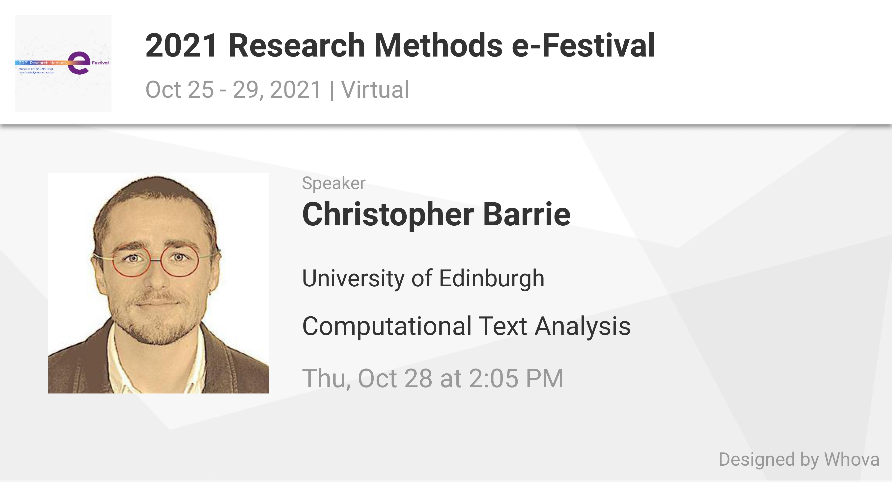

# CTA-NCRM

Repository of materials for ESRC National Centre for Research Methods Computational Text Analysis workshop. October 28, 2021.

Introduction slides can be found [here](https://docs.google.com/presentation/d/1vGeO-EJeUo6W3A-JwENb4Ba87I_kAoAP3i8NJrpOuqA/edit?usp=sharing).

You can use this in several ways:

1. You might want to "clone" the entire repository and save all of the files in here locally. That's fine if you have some experience using R and R Markdown and know how to navigate the different file types contained in here. 
2. Recommended for beginners: you can use the quick links below to access online versions of the content, which are more easily accessible. I suggest you then copy and paste code snippets from the online documents into your own .R scripts.

## Outline of the materials

You will find in the Introduction documents an overview of how you install R and RStudio on your own devices, as well as some pointers on where to go for more help and information using these tools.

Each subsequent document is dedicated to a particular text analysis technique, as covered in the video tutorial accompanying the workshop

## Quick links for each topic

- Introduction: \[[Worksheet](https://raw.githack.com/cjbarrie/CTA-NCRM/main/00-intro/00-intro.html)\]
- Exercise 1---word frequency analysis: \[[Worksheet](https://raw.githack.com/cjbarrie/CTA-NCRM/main/01-word-freq/01-word-freq.html)\]\[[Slides](https://raw.githack.com/cjbarrie/CTA-NCRM/main/01-word-freq/01-word-freq-pres.html)\]
- Exercise 2---sentiment analysis: \[[Worksheet](https://raw.githack.com/cjbarrie/CTA-NCRM/main/02-sent-analysis/02-sent-analysis.html)\]\[[Slides](https://raw.githack.com/cjbarrie/CTA-NCRM/main/02-sent-analysis/02-sent-analysis-pres.html)\]
- Exercise 3---topic models: \[[Worksheet](https://raw.githack.com/cjbarrie/CTA-NCRM/main/03-topic-models/03-topic-models.html)\]\[[Slides](https://raw.githack.com/cjbarrie/CTA-NCRM/main/03-topic-models/03-topic-models-pres.html)\]
- Exercise 4---word embedding: \[[Worksheet](https://raw.githack.com/cjbarrie/CTA-NCRM/main/04-word-embed/04-word-embed.html)\]\[[Slides](https://raw.githack.com/cjbarrie/CTA-NCRM/main/04-word-embed/04-word-embed-pres.html)\]

